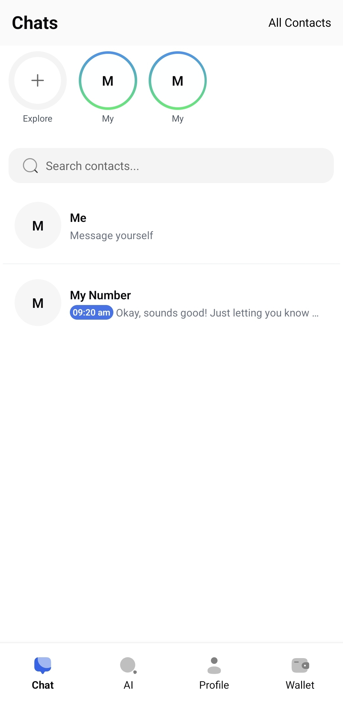
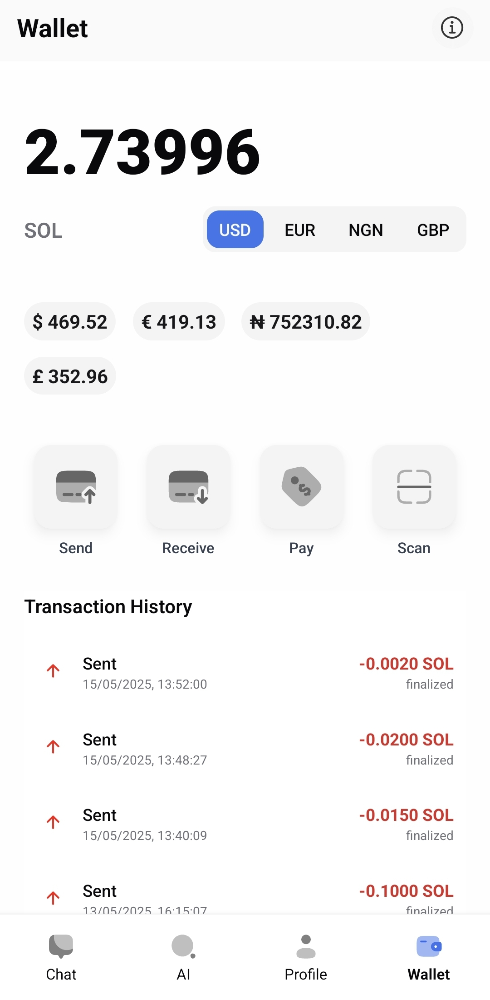
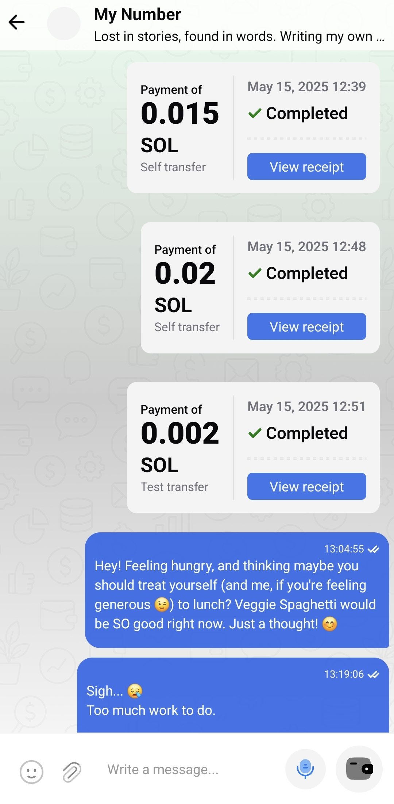

[//]: # (# SCAN)

[//]: # (Chats are tied to phone number,)

[//]: # (Financial transactions are tied to Wallets.)

[//]: # (The separation of concern on SCAN.)

# 🚀 Scan — Decentralized Messaging + DeFi on Solana

**Scan** is a mobile-first Web3 chat and DeFi wallet built for speed, privacy, and secure transactions. It combines encrypted messaging, SPL token management, Solana Pay, and AI-powered transaction risk analysis — all in one sleek, contact-verified app.

---

## ✨ Features

- 📱 **End-to-End Encrypted Messaging**
    - Phone number-based authentication (via Supabase)
    - Optional encryption using public wallet keys
    - Message signatures for sender authenticity

- 💸 **Solana DeFi Wallet**
    - Send/receive SOL and SPL tokens
    - View token balances and NFTs
    - Solana Pay integration

- 🧠 **AI Transaction Risk Analyzer**
    - AI-powered scoring before signing
    - User-customizable risk threshold + alerts
    - All high-risk attempts are logged

- 🌍 **DApp Browser**
    - Built-in browser with `window.solana` injection
    - Connect and sign transactions with supported DApps

- 🔔 **Push Notifications**
    - Supabase Edge Functions + Expo Push support
    - Get notified when messages arrive

---

## 🛠 Tech Stack

| Layer            | Tech                                  |
|------------------|---------------------------------------|
| Frontend         | Expo (React Native)                   |
| Backend          | Supabase (auth, Edge Functions)       |
| Blockchain       | Solana (Anchor, SPL tokens)           |
| AI Risk Model    | (GPT-4 / Gemini)                      |
| Notifications    | Expo Push Notifications               |
| Identity         | Phone-based login + wallet signatures |

---

## 📸 Screenshots







---

## 📦 Setup

```bash
git clone https://github.com/MayowaObisesan/scan-mobile.git
cd scan
yarn install
npx expo start
```

## Starter base

A starting point to help you set up your project quickly and use the common components provided by `react-native-reusables`. The idea is to make it easier for you to get started.

## Features

- NativeWind v4
- Dark and light mode
  - Android Navigation Bar matches mode
  - Persistent mode
- Common components
  - ThemeToggle, Avatar, Button, Card, Progress, Text, Tooltip


